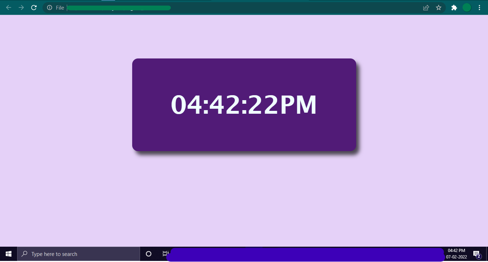

# Digital-Clock
Digital Clock Using JS

A digital clock web-page which shows the current local time and is buuild using HTML, CSS, Bootstrap and JavaScript.

Take a Look at : https://keerthana0711.github.io/Digital-Clock/

This is the preview of page:

